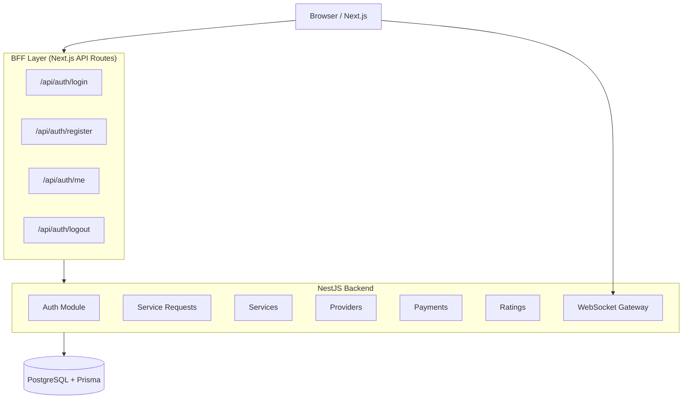
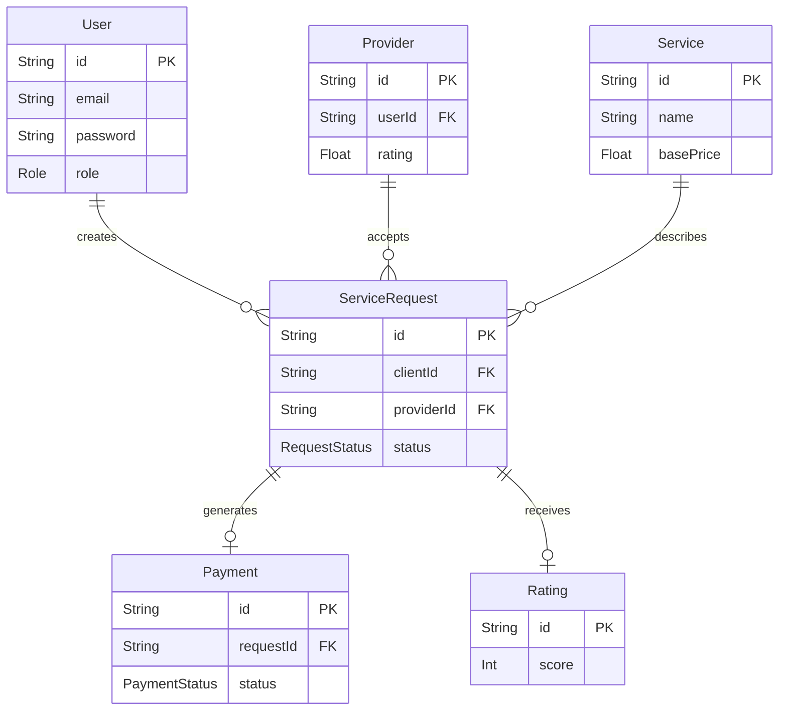
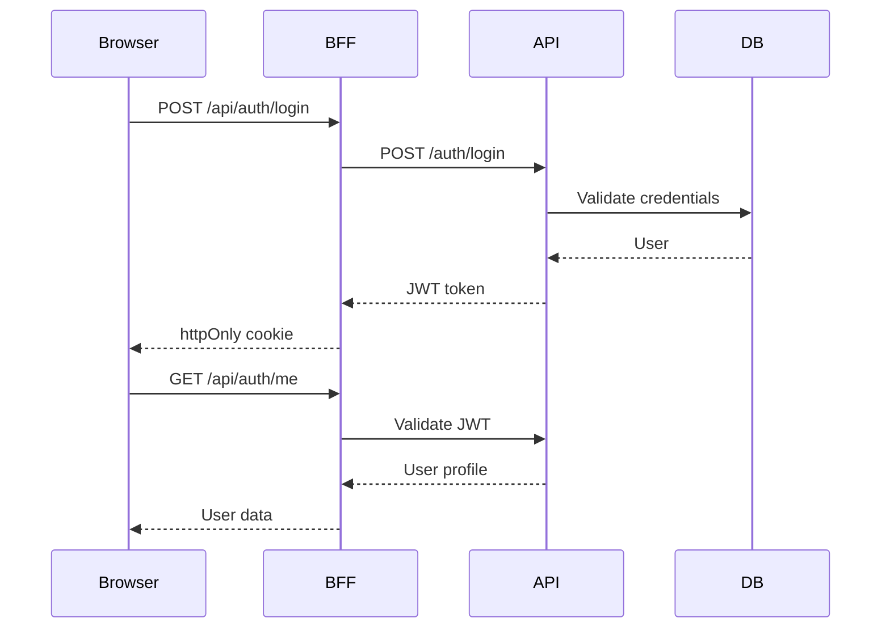
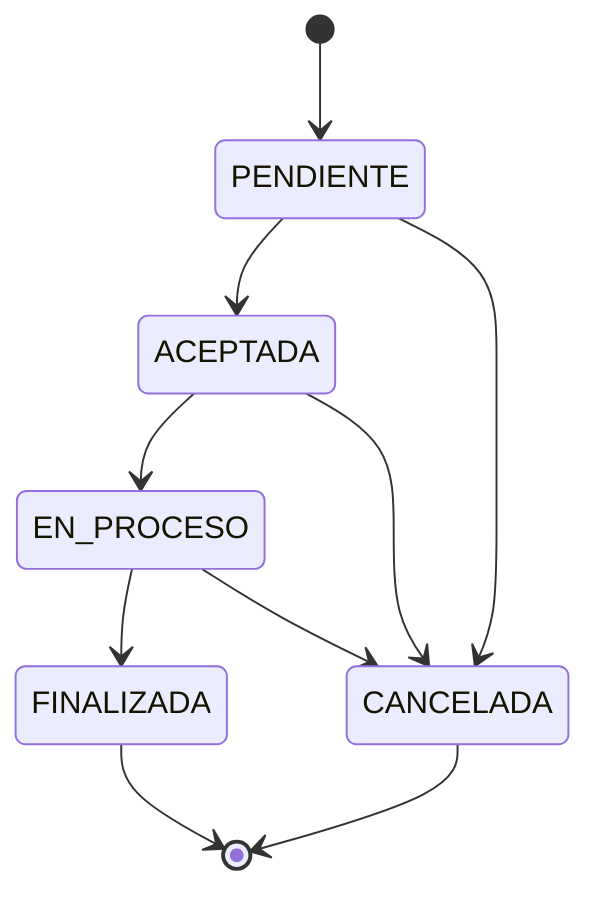

# e7_backend
# Harambal — Marketplace de Servicios a Domicilio

Sistema profesional de contratación de mano de obra local. Los clientes publican solicitudes de servicio, los proveedores las aceptan y ejecutan, los pagos quedan registrados y las calificaciones cierran el ciclo.

[](https://github.com/CamiloVe218/e7_backend/actions/workflows/ci.yml)


---

# Stack Tecnológico

| Capa            | Tecnología                                        |
| --------------- | ------------------------------------------------- |
| Frontend        | Next.js 14 (App Router), TypeScript, Tailwind CSS |
| Backend         | NestJS 10, TypeScript, Passport JWT               |
| Base de Datos   | PostgreSQL 15 + Prisma ORM                        |
| Tiempo Real     | Socket.IO (WebSockets)                            |
| Autenticación   | JWT + httpOnly Cookies (BFF Pattern)              |
| Seguridad       | Helmet, Throttler, bcrypt, ValidationPipe         |
| Documentación   | Swagger / OpenAPI                                 |
| Infraestructura | Docker Compose + Dockerfiles multi-stage          |
| CI/CD           | GitHub Actions                                    |
| Despliegue      | Railway + Vercel                                  |

---

# Arquitectura del Sistema



---

# Modelo Entidad-Relación



---

# Flujo de Autenticación (BFF Pattern)



---

# Máquina de Estados — Solicitudes



---

# Estructura del Proyecto

```bash
servicios-app/
├── backend/
├── frontend/
├── infrastructure/
├── docs/
└── .github/
```

---

# Patrones de Diseño

| Patrón             | Ubicación                     | Propósito                      |
| ------------------ | ----------------------------- | ------------------------------ |
| BFF Pattern        | `frontend/src/app/api/auth`   | Seguridad con cookies httpOnly |
| Repository Pattern | `repositories/`               | Desacoplar Prisma              |
| State Machine      | `service-requests.service.ts` | Validación de transiciones     |
| Strategy Pattern   | `jwt.strategy.ts`             | Estrategia JWT                 |
| Guard Pattern      | `guards/`                     | Autenticación y autorización   |
| Decorator Pattern  | `decorators/`                 | Metadata declarativa           |
| Observer Pattern   | `notifications.gateway.ts`    | Eventos en tiempo real         |
| Module Pattern     | Toda la app NestJS            | Separación por dominios        |

---

# Módulos del Backend

| Módulo           | Responsabilidad       |
| ---------------- | --------------------- |
| auth             | Login, registro y JWT |
| users            | Gestión de usuarios   |
| providers        | Proveedores           |
| services         | Catálogo de servicios |
| service-requests | Solicitudes           |
| payments         | Pagos                 |
| ratings          | Calificaciones        |
| notifications    | WebSockets            |
| prisma           | PrismaService         |

---

# Eventos WebSocket

| Evento                 | Descripción        |
| ---------------------- | ------------------ |
| request:new            | Nueva solicitud    |
| request:accepted       | Solicitud aceptada |
| request:updated        | Actualización      |
| request:status_changed | Cambio de estado   |

---

# Instalación y Ejecución

## Requisitos

* Node.js 20+
* Docker + Docker Compose
* PostgreSQL

---

## Clonar el repositorio

```bash
git clone <repo-url>
cd servicios-app
```

---

## Variables de entorno

### Backend

```bash
cp backend/.env.example backend/.env
```

### Docker

```bash
cp infrastructure/.env.example infrastructure/.env
```

---

## Generar JWT_SECRET

```bash
openssl rand -hex 64
```

---

# Ejecutar con Docker

```bash
cd infrastructure
docker compose up --build
```

| Servicio | URL                            |
| -------- | ------------------------------ |
| Frontend | http://localhost:3000          |
| Backend  | http://localhost:4000/api      |
| Swagger  | http://localhost:4000/api/docs |

---

# Ejecutar en Desarrollo

## Backend

```bash
cd backend
npm install
npx prisma migrate dev
npx prisma db seed
npm run start:dev
```

## Frontend

```bash
cd frontend
npm install
npm run dev
```

---

# Variables de Entorno

## Backend

| Variable       | Descripción    |
| -------------- | -------------- |
| DATABASE_URL   | URL PostgreSQL |
| JWT_SECRET     | Secreto JWT    |
| JWT_EXPIRES_IN | Expiración     |
| PORT           | Puerto backend |
| FRONTEND_URL   | URL frontend   |

---

# Datos de Prueba

| Rol       | Email                                           | Contraseña   |
| --------- | ----------------------------------------------- | ------------ |
| Admin     | [admin@demo.com](mailto:admin@demo.com)         | admin123     |
| Cliente   | [cliente@demo.com](mailto:cliente@demo.com)     | cliente123   |
| Proveedor | [proveedor@demo.com](mailto:proveedor@demo.com) | proveedor123 |

---

# API Reference

Swagger disponible en:

```bash
http://localhost:4000/api/docs
```

---

# Endpoints Principales

## Auth

| Método | Ruta               |
| ------ | ------------------ |
| POST   | /api/auth/register |
| POST   | /api/auth/login    |
| GET    | /api/auth/me       |

---

## Services

| Método | Ruta              |
| ------ | ----------------- |
| GET    | /api/services     |
| POST   | /api/services     |
| PATCH  | /api/services/:id |
| DELETE | /api/services/:id |

---

## Service Requests

| Método | Ruta                             |
| ------ | -------------------------------- |
| GET    | /api/service-requests            |
| POST   | /api/service-requests            |
| PATCH  | /api/service-requests/:id/accept |
| PATCH  | /api/service-requests/:id/status |

---

# Testing

```bash
cd backend

npm test
npm run test:cov
npm run test:watch
```

## Cobertura

* Auth Service
* Auth Controller
* Service Requests
* Services
* Users

Total: 55 tests.

---

# CI/CD — GitHub Actions

Pipeline ejecutado en cada push:

```bash
Backend:
✓ npm ci
✓ prisma generate
✓ eslint
✓ jest
✓ build

Frontend:
✓ npm ci
✓ next build

Docker:
✓ docker compose config
```

---

# Docker

## Levantar todo

```bash
cd infrastructure
docker compose up --build
```

## Construir backend

```bash
docker build -f infrastructure/Dockerfile.backend -t harambal-backend backend/
```

## Construir frontend

```bash
docker build -f infrastructure/Dockerfile.frontend -t harambal-frontend frontend/
```

---

# Despliegue

## Backend — Railway

Variables necesarias:

* DATABASE_URL
* JWT_SECRET
* FRONTEND_URL
* NODE_ENV=production

---

## Frontend — Vercel

Variables necesarias:

* NEXT_PUBLIC_API_URL
* NEXT_PUBLIC_WS_URL

---

# Seguridad

| Medida              | Implementación        |
| ------------------- | --------------------- |
| JWT seguro          | Cookie httpOnly       |
| Password hashing    | bcrypt                |
| Rate limiting       | Throttler             |
| Headers seguros     | Helmet                |
| Validación          | ValidationPipe        |
| Manejo de errores   | GlobalExceptionFilter |
| CORS                | Restrictivo           |
| Variables sensibles | `.env` fuera de Git   |

---

# Roles del Sistema

| Rol       | Capacidades                   |
| --------- | ----------------------------- |
| CLIENTE   | Crear solicitudes y calificar |
| PROVEEDOR | Aceptar y completar trabajos  |
| ADMIN     | Gestión global                |

---

# Características Destacadas

* Arquitectura enterprise con NestJS
* WebSockets en tiempo real
* JWT seguro con BFF Pattern
* Máquina de estados
* Docker multi-stage
* CI/CD automatizado
* Swagger/OpenAPI
* PostgreSQL + Prisma ORM
* Frontend responsive mobile-first

---

# Estado del Proyecto

| Área              | Estado |
| ----------------- | ------ |
| Backend         
| Frontend           | SI  |
| Docker           | SI  |
| Seguridad      | SI  |
| CI/CD               | SI  |
| Testing           | | SI  |
| Swagger             | SI  |
| Responsive Design   | SI  |

---

# Autor

Proyecto desarrollado por el Equipo 7 como plataforma full-stack profesional de contratación de servicios locales.

