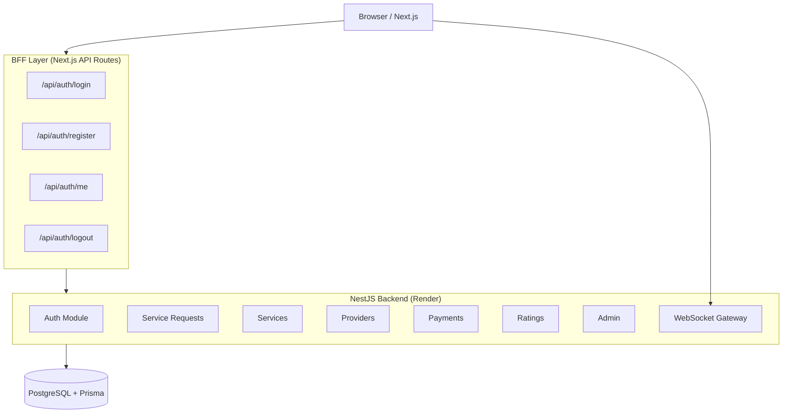
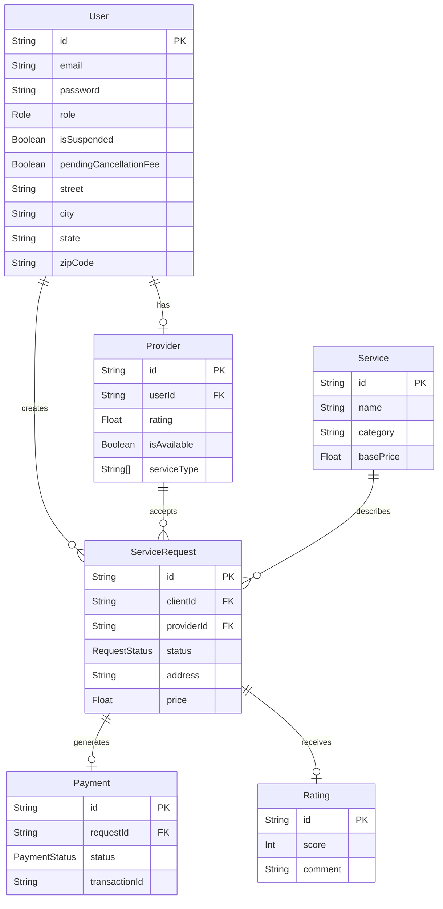
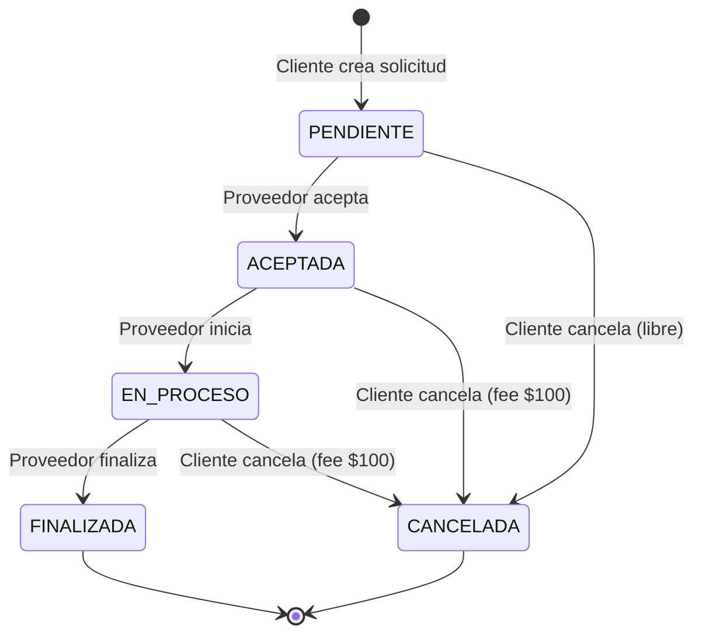
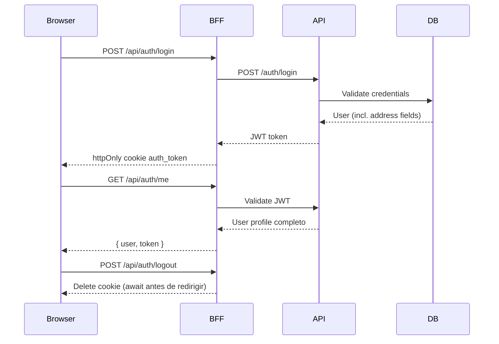

# Harambal — Marketplace de Servicios a Domicilio

Plataforma full-stack de contratación de mano de obra local. Los clientes publican solicitudes, los proveedores las aceptan y ejecutan, los pagos quedan registrados y las calificaciones cierran el ciclo.

[](https://github.com/CamiloVe218/e7_backend/actions/workflows/ci.yml)


---

## URLs de Producción

| Servicio | URL |
|----------|-----|
| Backend API | https://e7-backend.onrender.com/api |
| Swagger / Docs | https://e7-backend.onrender.com/api/docs |
| Health check | https://e7-backend.onrender.com/api/health |

---

## Acceso Rápido — Cuentas de Prueba

> Contraseña de todas las cuentas demo: **`Harambal2025!`**

### Admin

| Campo | Valor |
|-------|-------|
| Email | `admin.harambal@gmail.com` |
| Contraseña | `Harambal2025!` |
| Rol | `ADMIN` |
| Dashboard | `/dashboard/admin` |

### Clientes demo

| Email | Nombre |
|-------|--------|
| `sofia.ramirez92@gmail.com` | Sofía Ramírez |
| `carlos.mendoza@gmail.com` | Carlos Mendoza |
| `luciana.torres@gmail.com` | Luciana Torres |
| `miguel.hernandez@gmail.com` | Miguel Hernández |
| `valentina.cruz@gmail.com` | Valentina Cruz |

### Proveedores demo

| Email | Nombre | Servicio | Rating |
|-------|--------|----------|--------|
| `juan.plomero.oax@gmail.com` | Juan Pérez Gómez | Plomería | 4.8 |
| `mario.electrico@gmail.com` | Mario García Ruiz | Electricidad | 4.6 |
| `ana.limpieza.pro@gmail.com` | Ana López Reyes | Limpieza | 4.9 |
| `roberto.pintor@gmail.com` | Roberto Sánchez | Pintura, Carpintería | 4.7 |
| `fernanda.jardineria@gmail.com` | Fernanda Vásquez | Jardinería | 4.5 |

---

## Stack Tecnológico

| Capa | Tecnología |
|------|------------|
| Frontend | Next.js 14 (App Router), TypeScript, Tailwind CSS |
| Backend | NestJS 10, TypeScript, Passport JWT |
| Base de Datos | PostgreSQL 15 + Prisma ORM |
| Tiempo Real | Socket.IO (WebSockets) |
| Autenticación | JWT + httpOnly Cookies (BFF Pattern) |
| Seguridad | Helmet, Throttler, bcrypt, ValidationPipe |
| Documentación | Swagger / OpenAPI |
| Infraestructura | Docker Compose + Dockerfiles multi-stage |
| CI/CD | GitHub Actions |
| Despliegue | Render (backend) |

---

## Arquitectura del Sistema



---

## Modelo Entidad-Relación



---

## Máquina de Estados — Solicitudes



> Cancelar desde `ACEPTADA` o `EN_PROCESO` activa un cargo de $100 MXN en la siguiente solicitud del cliente.

---

## Flujo de Autenticación (BFF Pattern)



---

## Estructura del Proyecto

```
servicios-app/
├── backend/
│   ├── prisma/
│   │   ├── migrations/         # 4 migraciones históricas
│   │   ├── safe-migrate.js     # Script de arranque seguro
│   │   ├── seed.ts / seed.js   # Datos demo idempotentes
│   │   └── schema.prisma
│   └── src/
│       ├── auth/               # JWT, guards, strategies
│       ├── service-requests/   # Máquina de estados
│       ├── services/           # Catálogo
│       ├── providers/          # Perfiles proveedor
│       ├── payments/           # Pagos simulados
│       ├── ratings/            # Calificaciones
│       ├── notifications/      # WebSocket gateway
│       ├── admin/              # Gestión admin
│       └── shared/
├── frontend/
│   └── src/
│       ├── app/
│       │   ├── api/auth/       # BFF routes
│       │   ├── auth/           # Login / Register
│       │   └── dashboard/      # Client, Provider, Admin, History
│       ├── components/
│       │   └── requests/       # ServiceRequestDrawer, RequestCard
│       ├── contexts/           # AuthContext, ToastContext
│       ├── hooks/              # useSocket, useConnectionStatus
│       └── lib/                # api.ts, socket.ts, catalog.ts
└── infrastructure/
    ├── Dockerfile.backend      # Multi-stage build
    ├── Dockerfile.frontend
    └── docker-compose.yml
```

---

## Patrones de Diseño

| Patrón | Ubicación | Propósito |
|--------|-----------|-----------|
| BFF Pattern | `frontend/src/app/api/auth` | Seguridad con cookies httpOnly |
| Repository Pattern | `repositories/` | Desacoplar Prisma |
| State Machine | `service-requests.service.ts` | Validación de transiciones |
| Strategy Pattern | `jwt.strategy.ts` | Estrategia JWT |
| Guard Pattern | `guards/` | Autenticación y autorización |
| Decorator Pattern | `decorators/` | Metadata declarativa |
| Observer Pattern | `notifications.gateway.ts` | Eventos en tiempo real |
| Module Pattern | Toda la app NestJS | Separación por dominios |

---

## Módulos del Backend

| Módulo | Responsabilidad |
|--------|-----------------|
| auth | Login, registro, JWT, guards |
| users | Perfil de usuario |
| providers | Perfiles proveedor, disponibilidad, geolocalización |
| services | Catálogo de servicios |
| service-requests | Solicitudes + máquina de estados |
| payments | Pagos simulados |
| ratings | Calificaciones + promedio dinámico |
| notifications | WebSocket gateway (Socket.IO) |
| admin | Suspensión de usuarios, cancelación admin |
| prisma | PrismaService global |

---

## Eventos WebSocket

| Evento | Emisor | Destinatario | Descripción |
|--------|--------|--------------|-------------|
| `request:new` | Al crear solicitud | Broadcast (todos) | Nueva solicitud disponible |
| `request:accepted` | Al aceptar | Cliente | Solicitud aceptada por proveedor |
| `request:updated` | En cada cambio | Broadcast | Actualización general |
| `request:status_changed` | Al cambiar estado | Cliente + Proveedor | Cambio de estado |
| `request:completed` | Al finalizar | Solo cliente | Servicio completado (activa toast) |

---

## Endpoints Principales

### Auth

| Método | Ruta | Auth | Descripción |
|--------|------|------|-------------|
| POST | `/auth/register` | No | Registrar usuario |
| POST | `/auth/login` | No | Iniciar sesión |
| GET | `/auth/me` | JWT | Perfil completo (incl. dirección) |

### Service Requests

| Método | Ruta | Rol | Descripción |
|--------|------|-----|-------------|
| POST | `/service-requests` | CLIENTE | Crear solicitud |
| GET | `/service-requests` | Todos | Listar (filtradas por rol) |
| GET | `/service-requests/history` | Todos | Historial FINALIZADA/CANCELADA |
| GET | `/service-requests/stats` | ADMIN | Estadísticas globales |
| PATCH | `/service-requests/:id/accept` | PROVEEDOR | Aceptar solicitud |
| PATCH | `/service-requests/:id/status` | Todos | Cambiar estado |

### Payments

| Método | Ruta | Descripción |
|--------|------|-------------|
| POST | `/payments` | Crear registro de pago |
| POST | `/payments/:requestId/simulate` | Simular pago |
| GET | `/payments/:requestId` | Obtener pago |

### Ratings

| Método | Ruta | Descripción |
|--------|------|-------------|
| POST | `/ratings` | Calificar servicio (CLIENTE) |
| GET | `/ratings/provider/:id` | Calificaciones de proveedor |

### Providers

| Método | Ruta | Descripción |
|--------|------|-------------|
| GET | `/providers` | Listar proveedores |
| GET | `/providers/profile` | Perfil propio (PROVEEDOR) |
| PATCH | `/providers/profile` | Actualizar perfil / disponibilidad |

### Admin

| Método | Ruta | Descripción |
|--------|------|-------------|
| PATCH | `/admin/users/:id/suspend` | Suspender usuario |
| PATCH | `/admin/users/:id/reactivate` | Reactivar usuario |
| PATCH | `/admin/requests/:id/cancel` | Cancelar solicitud |

---

## Instalación y Desarrollo

### Requisitos

- Node.js 20+
- Docker + Docker Compose
- PostgreSQL 15

### Clonar

```bash
git clone https://github.com/CamiloVe218/e7_backend.git
cd e7_backend/servicios-app
```

### Variables de entorno

```bash
# Backend
cp backend/.env.example backend/.env

# Docker
cp infrastructure/.env.example infrastructure/.env
```

### Generar JWT_SECRET

```bash
node -e "console.log(require('crypto').randomBytes(64).toString('hex'))"
```

### Backend (desarrollo)

```bash
cd backend
npm install
npx prisma migrate dev
npm run prisma:seed     # crea datos demo
npm run start:dev
```

### Frontend (desarrollo)

```bash
cd frontend
npm install
npm run dev
```

### Con Docker

```bash
cd infrastructure
cp .env.example .env   # llenar variables
docker compose up --build
```

| Servicio | URL |
|----------|-----|
| Frontend | http://localhost:3000 |
| Backend | http://localhost:4000/api |
| Swagger | http://localhost:4000/api/docs |

---

## Variables de Entorno

### Backend

| Variable | Descripción | Requerida |
|----------|-------------|-----------|
| `DATABASE_URL` | URL de conexión PostgreSQL | Sí |
| `JWT_SECRET` | Secreto JWT (mín. 64 chars) | Sí |
| `JWT_EXPIRES_IN` | Expiración del token (ej. `7d`) | Sí |
| `PORT` | Puerto del servidor (default: 4000) | No |
| `FRONTEND_URL` | URL del frontend para CORS | Sí |
| `NODE_ENV` | `development` o `production` | No |
| `SEED_PASSWORD` | Contraseña para cuentas demo | No |
| `SEED_ADMIN_EMAIL` | Email del admin del seed | No |

### Frontend

| Variable | Descripción |
|----------|-------------|
| `NEXT_PUBLIC_API_URL` | URL del backend API |
| `NEXT_PUBLIC_WS_URL` | URL para WebSocket |
| `BACKEND_URL` | URL interna BFF → backend |

---

## Startup Seguro de Producción

El script `prisma/safe-migrate.js` se ejecuta automáticamente al iniciar:

1. Detecta si la BD tiene historial de migraciones
2. Si no tiene (`db push` previo) → hace baseline automático
3. Ejecuta `prisma migrate deploy` — nunca usa `--accept-data-loss`
4. Si `services.count === 0` → ejecuta seed automáticamente
5. Arranca el servidor

```bash
# Nunca más:
npx prisma db push --accept-data-loss && node dist/main

# Ahora:
node prisma/safe-migrate.js && node dist/main
```

---

## Testing

```bash
cd backend
npm test                # todos los tests
npm run test:cov        # con cobertura
npm run test:watch      # modo watch
```

**159 tests — 15 suites**

| Suite | Tests |
|-------|-------|
| auth.service | 8 |
| jwt.strategy | 5 |
| roles.guard | — |
| notifications.gateway | 10 |
| service-requests.service | 34 |
| service-requests.integration | — |
| payments | — |
| ratings | — |
| services | — |
| users | — |

---

## Seguridad

| Medida | Implementación |
|--------|----------------|
| JWT seguro | Cookie httpOnly + BFF |
| Password hashing | bcrypt (10 rounds) |
| Rate limiting | `@Throttle` por endpoint |
| Headers seguros | Helmet |
| Validación | `ValidationPipe` (whitelist + transform) |
| Manejo de errores | `GlobalExceptionFilter` |
| CORS | Restrictivo — solo orígenes permitidos |
| Suspensión de usuarios | `isSuspended` en login |
| Variables sensibles | `.env` fuera de Git |

---

## Roles del Sistema

| Rol | Capacidades |
|-----|-------------|
| `CLIENTE` | Crear solicitudes, cancelar, pagar, calificar |
| `PROVEEDOR` | Aceptar solicitudes, iniciar, finalizar trabajo |
| `ADMIN` | Suspender usuarios, cancelar solicitudes, ver estadísticas |

---

## Características Implementadas

- Arquitectura enterprise con NestJS 10
- BFF Pattern con cookies httpOnly — sin tokens en localStorage
- Máquina de estados validada con transacciones atómicas (Prisma)
- WebSockets en tiempo real con soporte multi-tab
- `request:completed` socket event al cliente cuando servicio finaliza
- Penalización $100 MXN por cancelación tardía (flag `pendingCancellationFee`)
- Logout seguro — await cookie delete antes de redirect
- Seed automático en producción — `safe-migrate.js` detecta BD vacía
- Historial correcto por rol: proveedor ve FINALIZADA sin rating
- `GET /auth/me` retorna perfil completo (dirección, teléfono, flags)
- Docker multi-stage optimizado
- Swagger/OpenAPI documentado
- CI/CD con GitHub Actions
- Frontend mobile-first con Tailwind CSS

---

## Estado del Proyecto

| Área | Estado |
|------|--------|
| Backend NestJS | Completo |
| Frontend Next.js 14 | Completo |
| WebSockets tiempo real | Completo |
| Autenticación JWT + BFF | Completo |
| Máquina de estados | Completo |
| Pagos (simulados) | Completo |
| Calificaciones | Completo |
| Panel Admin | Completo |
| Docker / Infraestructura | Completo |
| Migraciones seguras | Completo |
| Tests (159) | Completo |
| Swagger | Completo |
| Deploy en Render | Activo |
| Penalización cancelación | Phase 1 |

---

## CI/CD — GitHub Actions

Pipeline ejecutado en cada push a `master`:

```
Backend:
  ✓ npm ci
  ✓ prisma generate
  ✓ eslint
  ✓ jest (159 tests)
  ✓ build

Frontend:
  ✓ npm ci
  ✓ next build

Docker:
  ✓ docker compose config
```

---

## Despliegue en Render

### Backend

Variables de entorno necesarias en Render:

```
DATABASE_URL=postgresql://...
JWT_SECRET=<64+ chars aleatorios>
JWT_EXPIRES_IN=7d
PORT=4000
FRONTEND_URL=https://tu-frontend.com
NODE_ENV=production
SEED_PASSWORD=<contraseña segura para cuentas demo>
```

El startup ejecuta automáticamente:
1. Migraciones pendientes (`prisma migrate deploy`)
2. Seed del catálogo si la BD está vacía

---

## Autor

Proyecto desarrollado por el **Equipo 7** como plataforma full-stack profesional de contratación de servicios locales.
